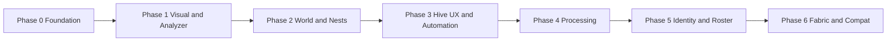

# Curious Bees — Roadmap

High-level plan for turning the validated **genetics core** into a **polished, automation-friendly** bee mod: Productive Bees–grade UX and loop quality, **without** being a fork — Curious Bees keeps **living bees**, **Mendelian genomics**, and its own **species / textures / bee products**.

| Audience | Use |
|----------|-----|
| **Maintainers** | Phase ordering, exit gates, open decisions → ADRs |
| **Contributors / AI agents** | Scope guardrails + links to specs; pair with `CLAUDE.md` workflow |
| **Players / pack makers** | Expectation management only — not a changelog |

**Technical contract:** [`architecture.md`](architecture.md). **Product contract:** [`requirements.md`](requirements.md). **Locked decisions:** [`decisions.md`](decisions.md). **Operational breakdown:** [`TASKS.md`](TASKS.md). **Project entry point:** [`project-guide.md`](project-guide.md).

**Hive v1 (floor):** [`decisions.md` → ADR-0009](decisions.md) — subclass of vanilla hive, production additive to honey, no capture item required for first use.

---

## North star

- **World:** diverse species in sensible habitats; **wild nests** with Forestry-like *variety* (many nest types / looks) but **vanilla-like interaction** (pathing, occupancy, harvest patterns players already understand).
- **Base loop:** breeding and discovery stay **entity-first** in the open world; genetics remain readable **after analysis**, not chat-only.
- **Production:** **crafted hive / advanced hive** layer that feels as **clear, extensible, and automation-ready** as Productive Bees: slots, upgrades/extensions where needed, visible bee state, predictable outputs, hopper/pipe-friendly sides.
- **Processing:** **combs** → machine line (e.g. **centrifuge**) separating **honey**, **by-products**, and **wax** — same *role* as familiar mods, Curious Bees IDs and balance.
- **Identity:** own GUI art and layout can start “PB-shaped” for learnability, then diverge; **no** goal of pixel-perfect clone.

### Non-goals (until explicitly replanned)

Aligned with current ADRs and `Readme.md`: **resource bee trees**, **lifecycle/death/larvae as enforced sim**, **temperature/humidity climate engine**, **Fabric gameplay parity** before NeoForge loop is solid, **JEI/REI** before in-game UX explains the basics.

### Relationship to ADR-0009 (important)

ADR-0009 defines the **first** Genetic Apiary: vanilla housing parity, additive comb production, **no** centrifuge, **no** real frame items, **no** “caught bee” requirement. This roadmap **extends** that foundation — later phases **explicitly** add what was listed “out of scope” there (frames, centrifuge, richer GUI, optional transport) **without** rewriting the core decision that bees **enter hives voluntarily** like vanilla.

---

## Positioning vs. “Productive Bees–like”

Curious Bees is **not** trying to replace Productive Bees in packs. It is trying to be the option where **lineage, dominance, and mutation** matter and the **factory layer still feels modern**.

| Dimension | Productive Bees (reference) | Curious Bees (target) |
|-----------|----------------------------|------------------------|
| **Core fantasy** | Often block + cage bee loop | **Living** `Bee` entities + genetics on entity |
| **Progression** | Species discovery + recipes | **Breeding + analysis** + controlled production |
| **Automation** | Very mature | **Must** reach hopper/pipe clarity; deep per-mod compat later |
| **Content volume** | Huge roster | **Small branches**; quality over count ([`decisions.md` → ADR-0012](decisions.md)) |
| **Art / GUI** | Established house style | Learnable layout first, **own** art pass in Phase 5 |

**Viability:** overlap is inevitable and healthy — same audience. Differentiation is **genetics depth + vanilla bee feel + your art/names**. Marketing line: “**Productive-grade logistics, Forestry-grade curiosity.**”

---

## Open decisions (→ ADR when the slice starts)

> **These 3 ADRs must be written and committed to `decisions.md` BEFORE any P3/P4 feature code begins.** Each ADR should be preceded by a 30-minute design spike (mock or sketch) to validate the approach. See design doc `~/.gstack/projects/AdolfoCarneiro-bees/Adolfo-main-design-20260504-213936.md`.

| Topic | ADR | Question | Default / guidance | Trigger |
|--------|-----|----------|--------------------|---------|
| **Advanced hive footprint** | ADR-0013 | Single expandable block vs multiblock vs hybrid | **Default: single expandable block.** Multiblock is a one-way door (save-migration risk for players); requires strong evidence to override. | Before E3-T12 |
| **Bee capture item** | ADR-0014 | Optional scoped item for hive insertion; partial reversal of ADR-0009's capture rejection | Scope to hive-insertion only; design release mechanic before accepting | Before E3-T13/T14 |
| **Fluid honey** | ADR-0015 | Tanks/pipes vs bottle-only discrete honey | Start with discrete (bottle) if fluid registration blocks progress | Before E4-T01 |
| **Data-driven cutover** | [ADR-0010](decisions.md) | ✅ **Done** — JSON pipeline implemented in `ContentJsonLoader` | n/a | n/a |

---

## Phase dependency (read order)

**Parallelism rule:** art in P1 can overlap **early** P2 only if the same people are not blocked — otherwise finish P1 **Exit** first so nest work reuses final texture IDs. **Do not** start Phase 4 recipes until Phase 3 outputs and slot contracts exist, or you will rewrite recipes twice.

---

## Phase 0 — Shipped foundation (keep healthy)

**Goal:** genetics, breeding, mutations, analyzer touchpoint, production resolver, combs, first **Genetic Apiary** path — all stay regression-safe.

**Inventory (what already justifies this phase):**

- Pure Java genetics + tests (`ADR-0002`).
- NeoForge genome storage + spawn integration.
- `ProductionResolver` + built-in species/products.
- `GeneticApiaryBlock` / `BlockEntity` / menu / screen (see codebase + `0009`).

**What's already implemented (discovered 2026-05-04):**

| Component | Status |
|-----------|--------|
| `SpeciesTextureResolver` + `CuriousBeeBeeRenderer` | ✅ Done — texture-per-species + 3-tier fallback |
| `GeneticApiaryBlockEntity` frame inventory (3 slots) + output (6 slots) | ✅ Done |
| `BuiltinFrameModifiers` wired into `addOccupant` production roll | ✅ Done |
| Frame items (`BASIC_FRAME`, `MUTATION_FRAME`, `PRODUCTIVITY_FRAME`) | ✅ Done — need recipe stubs + durability |
| `automationOutputView` IItemHandler + `ContainerData` sync | ✅ Done — sided IO bug (E0-T07) |
| `ContentJsonLoader` pipeline (ADR-0010) | ✅ Done |

**Hardening checklist (ongoing):**

- [ ] CI green on `common` + `neoforge` tests.
- [ ] **E0-T07:** Fix `ApiaryCapabilities` sided IO + `curiousbees:frames` item tag (active bug — hopper below can insert frames).
- [ ] **E0-T08:** Cache entity scan in `GeneticApiaryBlockEntity` (performance — 20x/sec scan).
- [ ] **E3-T08:** Frame durability — frames are currently immortal; implement before P3 ships.
- [ ] WARNING logs on recoverable bad data (no silent swallow).

**Exit:** no open P0 regressions; a new contributor can run the mod and complete world breed → hive → comb without cheats.

---

## Phase 1 — Visual & species readability

**Goal:** players *see* Curious Bees, not “vanilla bees with a secret spreadsheet.”

**Deliverables**

| Track | Items |
|-------|--------|
| **Rendering** | Species → texture resolution for **living** bees — `SpeciesTextureResolver` + `CuriousBeeBeeRenderer` done; 5 DEV-PLACEHOLDER textures needed (E1-T12). |
| **Analyzer** | Screen (or block+screen) that respects **unanalyzed vs analyzed** ([`architecture.md` §5](architecture.md) visibility rules). |
| **Tooltips** | Analyzed: species / hybrid hints / traits as designed; unanalyzed: vague or gated — no full chromosome dump. |
| **Content hygiene** | Adding a species touches **data + lang + visual key**, not random `if` in handlers ([`architecture.md` §7](architecture.md), naming [`decisions.md` → ADR-0011](decisions.md)). |
| **Assets** | Per [`asset-generation-guidelines.md`](asset-generation-guidelines.md); no undeclared “final” placeholders. |

**Risks**

- Client-only desync → **test multiplayer** for analyzer + tooltip paths.
- Texture explosion → enforce **manifest or checklist** per species before merge.

**Additional P1 deliverable (from CEO review 2026-05-04):** Mutation feedback — subtle particle + sound in `BeeBreedingEventHandler` when mutation occurs; makes the genetics loop emotionally rewarding (E1-T13).

**Exit:** new player can tell species apart in-world and after analysis **without** debug commands; analyzer is usable in survival.

---

## Phase 2 — World presence & nests

**Goal:** “bees in the right places” + nest variety that sells the mod in the first five minutes.

**Deliverables**

| Track | Items |
|-------|--------|
| **Spawn** | Habitat metadata per species: biome tags, height bands, light — **simple** predicates only ([`architecture.md` §7](architecture.md)). |
| **Nests** | Multiple wild nest blocks or variants; **vanilla-grade** interaction (anger, harvest, occupancy); align POI / hive targeting with code paths such as `BeeSpeciesHiveTargetHandler`. |
| **Population** | Sane caps / chunk friendliness; no bee soup lag spikes. |
| **Discovery** | Optional journal / patchouli **later** — not a gate for Phase 2 exit. |

**Risks**

- Wrong nest ↔ species pairing → angry bees + confused players; add **debug overlay** or creative-only inspector if needed.
- Worldgen churn → prefer **surface features** over heavy structures until stable.

**Exit:** each **shipping** species has a believable default home; exploration visibly rewards finding new nests/bees.

---

## Phase 3 — Hive UX & automation (Productive-shaped)

**Goal:** the **crafted / advanced hive** is the main factory interface for production; ADR-0009 remains the **compatibility floor** for the base genetic hive.

**Deliverables**

| Track | Items |
|-------|--------|
| **GUI** | Frames + outputs + bee summary; occupancy and honey level obvious; errors human-readable. |
| **Frames** | Real **items** with effects wired through production resolver / modifiers (extends `0009` out-of-scope list intentionally). |
| **Representation** | “Bee inside” — start with **2D / entity preview / icon + status** if full 3D render is costly. |
| **Automation** | Sided `IItemHandler` (or successor) contracts: which sides insert/extract; output extract-only; document redstone if any. |
| **Advanced hive** | Either upgraded block or new tier — **ADR-0013 required first; default is single expandable block** (multiblock = save-migration risk). |
| **Optional energy** | Only if a future ADR adds it — default remains **no power** per `0009` unless design revises. |

**Risks**

- Feature parity creep → timebox “PB-like” to **automation clarity**, not every PB block.
- Breeding inside hive → still **out of default design** unless new ADR; keep breeding in the world to reduce coupling.

**Exit:** kitchen-sink pack player runs hive lines with hoppers/pipes **without** per-tick babysitting; frames change outputs in measurable ways.

---

## Phase 4 — Processing line

**Goal:** combs are the **hub** between hive output and the rest of a tech modlist.

**Deliverables**

| Track | Items |
|-------|--------|
| **Machine** | Centrifuge (name TBD) + block entity + menu. |
| **Recipes** | Comb → **wax** + **honey** (fluid or item) + **species by-products**; stub recipes for all shipping combs. |
| **Data** | Prefer moving recipe JSON together with [`decisions.md` → ADR-0010](decisions.md) timing — avoid hardcoding 30 JSON in Java. |
| **JEI/REI** | Phase 6 or late Phase 4 — only when recipes are stable enough not to churn. |

**Risks**

- Fluid registration order / modlist conflicts → start **discrete honey** if fluids block the exit.

**Exit:** closed loop **world → hive → comb → centrifuge → ingredients** with no dead-end inventory clutter.

---

## Phase 5 — Differentiation & “our face”

**Goal:** trailer-worthy identity; genetics is the reason to pick Curious Bees, UX is the reason to stay.

**Deliverables**

- Custom **GUI** backgrounds and sounds; replace dev placeholders.
- **Narrative / guide** (optional): Patchouli, in-game tips, or quest hooks — pick one, do it well.
- **Roster growth** in **small branches** (mutation lines that tell a story), not bulk species drops.
- **Balance pass** after telemetry from real play (rates, mutation pain, comb flow).
- **Resource bees** only per [`decisions.md` → ADR-0012](decisions.md) — dedicated design, not accidental ore bees.

**Exit:** blind playtesters describe the mod in **one sentence** without saying “it’s a PB clone.”

---

## Phase 6 — Fabric & compatibility (when scoped)

- **Fabric:** gameplay port when explicitly scheduled ([`decisions.md` → DR-010](decisions.md)); genetics core should already be loader-agnostic.
- **Cross-mod:** Create / AE2 / pipe mods — **explicit** issues per integration; no blanket “compat layer” spike.
- **Distribution:** add release docs when versions go public; do not pre-create empty folders.

**Exit:** each scoped integration has a test world checklist and an owner.

---

## Operating model (how to run this roadmap)

**Operational breakdown:** each phase is broken into **epics + tasks** in [`TASKS.md`](TASKS.md). Use that file to open issues; use this one to argue about phase order.

1. **Issues:** one issue per task row in `TASKS.md`; title uses the task id (e.g. `E3-T05`).
2. **Exit gates:** closing a phase = **all Exit bullets true**; if not, split scope rather than lowering the bar.
3. **ADR hygiene:** open-decision table rows graduate to a new entry in [`decisions.md`](decisions.md) with status **Accepted** before merge-heavy work lands.
4. **Playtests:** short notes per phase (what confused players) — append to the relevant phase section here, or open an issue.
5. **Review cadence:** re-read this file after major releases; trim stale bullets rather than append forever.

---

## How to use this file (short)

1. Pick the **lowest phase** whose **Exit** is false — that is the priority lane.  
2. Resolve **open decisions** with ADRs before building the expensive side (multiblock, fluids, transport).  
3. Keep **`common/genetics`** free of Minecraft imports in every PR ([`decisions.md` → ADR-0002](decisions.md)).

_Last updated: 2026-05-04._
